<!-- decorative bordered frame bar — GitHub strips <style>/CSS from READMEs, so a true wraparound border around the whole page isn't possible; this bar (top) + the matching one at the bottom bookend the profile with the same neon border-draw animation. -->

 

<!-- Main terminal: two large ASCII-art pieces assemble, hold fully visible, then disassemble and swap (left) + "cat /etc/profile" boot log (right). Upload ascii-face-terminal.svg next to this readme for it to render. -->

---

— About Me —

> I'm **CXQOK** — a free spirit and cyber wanderer roaming the digital underground.
> I craft exploits, break systems to understand them, and build tools that serve **absolute freedom**.
> My philosophy: information wants to be free, and every wall is just a temporary obstacle.

---

— The Arsenal —

  

---

— GitHub Stats —

&nbsp;&nbsp;

 

 

---

— Connect —

*DMs are open. Channel is live. Reach out — I don't bite... unless you're running Windows.*

&nbsp;

  

<!-- This renders only after you add .github/workflows/snake.yml (included in this zip) to your cxqok-x/cxqok-x repo and let the Action run once — see note below the code. -->

---

> *"The only secure system is the one you **fully control**."*
>
> — **CXQOK** · `root@freedom`

 

<!-- bottom half of the bordered frame — pairs with the one at the top of the page -->

